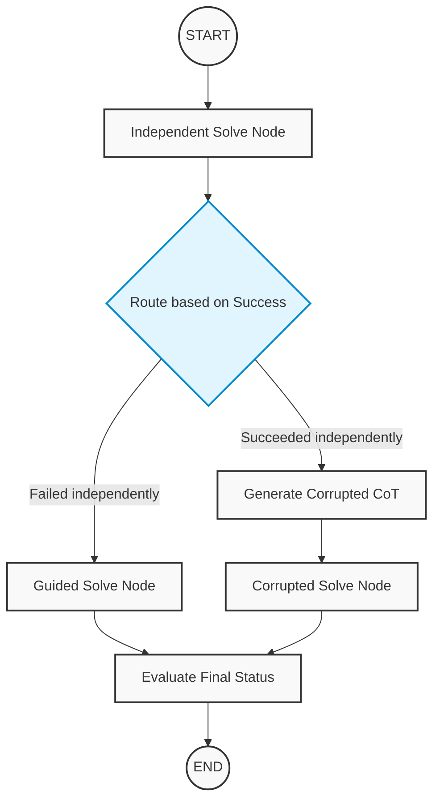

# Multi-Agent Chain-of-Thought (CoT) Evaluator

A highly concurrent, multi-agent AI pipeline built with **LangGraph** and **LangChain** to evaluate the reasoning capabilities of Large Language Models (LLMs). 

This project orchestrates a "Teacher-Student" ablation study to measure two critical AI research metrics:
1. **Reusability (Rescue Rate):** Can a smaller, weaker model successfully use the Chain-of-Thought (CoT) reasoning generated by a larger model to solve a problem it initially failed?
2. **Faithfulness / Overreliance:** If a smaller model can solve a problem independently, will it blindly follow a *corrupted* CoT from a larger model and arrive at the wrong answer?

## 🏗️ Architecture Overview

The system uses a Map-Reduce (Fan-Out) state machine architecture to maximize API throughput and local GPU utilization.

### 1. The Thinker Pipeline (Teacher)
A large teacher model evaluates a dataset of math/logic questions, generating step-by-step CoT reasoning and final answers. Only the questions the Thinker answers correctly are passed forward.

### 2. The Executor Fan-Out (Parallelization)
The filtered tasks are fanned out to `NUM_EXECUTORS` parallel instances of a smaller student model to account for LLM stochastics (randomness). 

### 3. The Executor Sub-Graph (Student)
Each parallel executor runs through a dynamic state machine that actively routes the model based on its independent capabilities:



##  The Orchestration Engine (`orchestrator.py`)

The entire pipeline is driven by a central orchestration script. You do not need to run individual agents manually. Running the orchestrator triggers a four-phase workflow:

1. **Phase 1: Thinker Execution:** Iterates through the loaded dataset and prompts the Teacher LLM to generate Chain-of-Thought (CoT) reasoning and a final answer.
2. **Phase 2: Data Filtering:** Automatically evaluates the Thinker's accuracy. Incorrect answers are discarded, and correct answers are saved to a local CSV (`thinker_correct_only.csv`) to prevent unnecessary API calls.
3. **Phase 3: Parallel Fan-Out:** The filtered questions, along with their valid CoTs, are dispatched simultaneously to `NUM_EXECUTORS` parallel instances of the Student LLM.
4. **Phase 4: Metric Aggregation:** The graph gathers the asynchronous results from the parallel sub-graphs and calculates the final Reusability and Overreliance scores.

---

##  Repository Structure

```text
.
├── orchestrator.py          # Main entry point: runs Thinker, filters data, fans out to Executors
├── load_dataset.py          # Handles dataset fetching and preprocessing
├── utilities.py             # Regex parsing, JSON extraction, and answer normalization
├── requirements.txt         # Project dependencies
├── thinker/
│   ├── thinker_agent.py     # Thinker StateGraph definition and model initialization
│   └── thinker_schema.py    # Pydantic models and TypedDicts for Thinker state
├── executor/
│   ├── executor_agent.py    # Executor Sub-Graph, Fan-Out graph, and routing logic
│   └── executor_schema.py   # State definitions for parallel tracking
└── prompts/
    ├── thinker_prompt.py    # Standard CoT generation prompt
    ├── corrupt_thinker_prompt.py # Forces the generation of mathematically flawed CoT
    └── executor_prompt.py   # Independent and Guided prompts for the student model
```

---

## Setup & Installation

Follow these steps to run the pipeline on your local machine. 

**1. Clone the repository:**
```bash
git clone [https://github.com/DataWorshipper/Chain-Of-Thought-Evaluation.git](https://github.com/DataWorshipper/Chain-Of-Thought-Evaluation.git)
cd Chain-Of-Thought-Evaluation
```

**2. Create and activate a Virtual Environment:**
This isolates the project dependencies from your global Python installation. *(Note: The `venv` folder is ignored by git to prevent massive file uploads).*

* **On Windows:**
  ```bash
  python -m venv venv
  venv\Scripts\activate
  ```
* **On macOS/Linux:**
  ```bash
  python3 -m venv venv
  source venv/bin/activate
  ```

**3. Install Requirements:**
```bash
pip install -r requirements.txt
```

**4. Configure Environment Variables:**
Create a file named `.env` in the root directory of the project and add your API keys and configuration limits:
```env
# Hugging Face API Token (or Groq API key if using Groq for the Thinker)
HUGGINGFACEHUB_API_TOKEN="hf_your_token_here"

# Concurrency Control: How many parallel student models to spawn per question
NUM_EXECUTORS=5
```

---

##  Running the Project

To execute the entire multi-agent pipeline, simply run the orchestration script from your terminal:

```bash
python orchestrator.py
```

### 🛠️ Configuration Tweaks
* **Testing limits:** If you want to run a quick test without burning through your API limits on the entire dataset, you can modify the `run_pipeline(num_samples=5)` call at the very bottom of `orchestrator.py`.
* **Model Swapping:** To change the models, simply update the `repo_id` or `model_id` parameters inside `thinker/thinker_agent.py` and `executor/executor_agent.py`.
